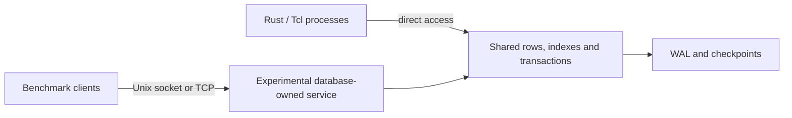

# Aerostore


[](https://github.com/zpconn/aerostore/actions/workflows/ci.yml)
[](https://github.com/zpconn/aerostore/actions/workflows/verify.yml)

A Rust database engine for high-ingest, frequently updated data shared between processes on a single host. Aerostore combines shared-memory storage, indexed queries, transactions, and write-ahead logging. It includes a Tcl extension with a flight-tracking example for batch ingestion and search.

The goal is to replace PostgreSQL's transactional state store in both single-machine and multi-machine FlightAware HyperFeed, with at least 10× the sustainable message throughput under matched semantics and resource budgets. That target has not been demonstrated. The repository uses synthetic flight-tracking scenarios informed by published HyperFeed descriptions; it does not include HyperFeed's application code. Multi-machine HyperFeed still uses one central database host.

**Status:** Experimental and under active development. APIs and storage formats can change. The project targets Linux, including WSL2, and is intended for development and workload evaluation.

## Results at a glance

These are synthetic workloads with different scopes. The service comparison counts fully processed incoming messages while arrivals continue; Crucible counts storage operations.

| Workload and configuration | Aerostore | PostgreSQL | Ratio | Latency and scope |
| --- | ---: | ---: | ---: | --- |
| 24-worker service, two 905-second trials per engine | 6,400 offered messages/s | 704 offered messages/s | **9.09×** | p99 9.0–9.2 ms vs 41.8–42.4 ms; matching correctness companions |
| Historical 16-worker service, repeated sustained trials | 3,072 offered messages/s | 640 offered messages/s | **4.8×** | Both meet the 50 ms p99 budget and queue, maintenance, resource and correctness guards |
| Historical Crucible, 2 GiB, 120 seconds | 315,881 ops/s | 51,098 ops/s | **6.18×** | Exact table/index agreement, ownership and reclamation checks pass |
| Historical Crucible, 2 GiB, 240 seconds | 309,568 ops/s | 50,592 ops/s | **6.12×** | 98.0% of the shorter run's aggregate throughput |

**Caveats:**

- The service rates are the highest repeatably passing tested endpoints: capacity lower bounds, not measured maxima. Their ratio does not establish a ratio of maximum capacities or the 10× target. The 24-worker trials completed about 6,399.97 vs 703.99 messages/s during arrivals under the same 24-logical-CPU and 36 GiB total-memory budget, with normal maintenance. Both instrumented correctness companions exceeded the latency requirement; the repeated metrics trials supply the capacity result.
- The service comparison uses PostgreSQL 16.13 with 128 MiB shared buffers, nine indexes and serialization-error SQL logging; Aerostore has five secondary indexes and direct row-ID access. It does not establish optimal PostgreSQL tuning. Transport, index maintenance and logging differ; physical multi-machine performance is unmeasured.
- Both service configurations acknowledge asynchronous WAL. Aerostore uses a volatile memfd arena and file WAL with periodic `fdatasync`; PostgreSQL keeps `fsync` and `full_page_writes` enabled. The ten-second write intervals do not establish equal crash-loss windows, recovery behavior or durable exactly-once delivery.
- Historical Crucible used PostgreSQL 16 and asynchronous commit on an Intel Core Ultra 9 285K under WSL2. Direct shared-memory access and client/server overhead differ. **Aerostore's update-only p99 was worse.** Historical percentile values were power-of-two bucket lower bounds; their ratios cannot establish precise tail-latency margins. Current reporting uses narrower integer intervals and conservative bounds; throughput is independent of that reporting defect.
- Failed and inconclusive results remain part of the record. Neither socket-write candidate established a repeatable gain or was promoted; the original service implementation was restored. Earlier frame-writing experiments also found no consistent gain. A prior engine performance repair passed correctness checks, but its automatic performance gate remained inconclusive because reference p99 noise exceeded the limit.

The [queue and worker-count report](docs/hyperfeed_queue_profile.md) explains the current result and rejected candidates; its [comparison summary](evidence/hyperfeed_queue_profile_2026-09-30/workers24-accepted-comparison01.json) binds the accepted trials. The historical 16-worker report is `docs/hyperfeed_sustained_capacity.md`; the [Crucible archive](https://github.com/zpconn/aerostore-archive/blob/archive/pre-rewrite/docs/bench_data/transactional_indexes_2026-09-22/README.md) retains the earlier storage comparison.

## How it works



The direct interface maps rows and indexes into multiple processes using relative pointers. Optimistic transactions provide versioned rows, savepoints, predicate conflict detection and atomic row/index publication. Secondary skiplist indexes support bounded range scans and a rule-based query planner.

WAL supports synchronous and asynchronous commits, delta updates, checkpoints and replay; compatible shared mappings support warm attachment. Background vacuum and index garbage collection reclaim storage during sustained updates.

The experimental database-owned service carries the 9.09× result and explores isolation from client-worker failures. It is a benchmark path, and does not establish production availability or recovery equivalence. The direct interface avoids SQL protocol and server round trips; service clients still pay RPC costs. Workload-specific indexed access, delta WAL records and storage recycling reduce scanning, serialized data and allocation churn. These design choices explain where gains can come from; their benefit depends on the workload and configuration.

## How it was built

Aerostore was built with AI coding agents. Systems code written this way earns trust through checks. Three kinds of guardrails grew alongside the engine: proofs bound to production source; tests and oracles for serializability, reference-model replay against PostgreSQL and deterministic fault injection; and benchmark sandboxes with paired screens, sustained trials, retained failures and evidence manifests.

Those checks reproduced and helped repair transactional-index failures, a public vacuum-horizon bug, WAL/checkpoint ordering bugs and a primary-key insertion race. The [fast iteration loop](docs/hyperfeed_iteration.md) now compares preserved baseline and candidate executables in short alternating screens, reserving full-history checks and sustained qualification for finalists. Passing a screen alone does not qualify a performance change.

## Correctness and verification

- **Proved components:** Verus checks production bucket kernels and conditional native commit, predicate, snapshot and indexed-read operations; Lean has a separate Rust extraction/proof chain. Physical storage, coherent-history, ownership, compiler and weak-memory assumptions remain explicit. The verified bucket implementations are opt-in; the default retains standard sort/dedup.
- **Models and tests:** TLA+ explores protocol, recovery and resource models. Seven bounded Loom cases exercise the production mutex, including a deliberately broken acquire-ordering control. Native regressions and Extended Crucible check reference-model replay, all six concurrency contracts and failure cases. A bounded replay never overrides a failed native contract.
- **Current boundary:** the October 2 component pilot passes all 72 checks with source and native-executable bindings. The public API contract audit is complete for its declared scope, while six engine obligations remain open. The complete concurrent P1 slice and whole-engine verification are unfinished; the `full` verification profile deliberately fails, and pilot success is not promotion approval.

See the [verification workspace](verification/README.md) for proved, assumed and tested scopes and setup commands. Independent-base checks are described in `docs/ci.md`. **Aerostore is not yet a formally verified database.**

## Status and limits

**Current availability gap:** the requirement is that other workers keep running after a worker is killed. The [failure probes](docs/worker_failure_contract.md) show that abandoned native guards can prevent surviving work from completing, and abandoned registrations can pin retention. Exclusive restart is not an acceptable substitute for that requirement. The current milestone is to evaluate contention and failure isolation before investing heavily in proofs of architectural choices that may change.

Aerostore is a Rust library and Tcl extension. SQL compatibility, distributed replication, and production authentication are outside the current scope. Ordered index policies remain optional and have a fixed time window; short latency and overload experiments do not establish realistic sustained capacity.

The current shared-memory layout is **version 5**, with boot metadata **version 7**. Older mappings require a cold rebuild using the appropriate durable recovery inputs; preserve WAL and checkpoints. A table binds to one WAL stream, and live changes to its commit mode, file or ring are rejected. Process death while holding shared locks and poisoned storage still require recovery. The [durability contract](verification/contracts/durability.md) records the remaining limits.

## Quick start: Rust and Tcl

Use Linux or WSL2, Rust **1.93.1** and Cargo; no minimum supported Rust version is declared. The process tests use Unix facilities including `fork`, shared mappings and signals. Install Tcl and native dependencies on Debian or Ubuntu:

```bash
sudo apt-get update
sudo apt-get install -y build-essential pkg-config tcl tcl-dev clang libclang-dev python3
cargo build --release --workspace --locked
```

For only the Rust engine, use `cargo build --release -p aerostore_core --locked`. Start integration with the public API in `aerostore_core/src/lib.rs` and the [transactional-index guide](docs/transactional_indexes.md): bind secondary indexes before transactions, query through `index_lookup`, and let commit maintain rows and indexes together. Raw posting operations are for initialization and diagnostics.

After the workspace build, run this from the repository root. It creates a fresh temporary data directory and dedicated shared mapping:

```bash
export AEROSTORE_DEMO_DIR="$(mktemp -d)"
export AEROSTORE_SHM_PATH="$AEROSTORE_DEMO_DIR/shared.mmap"

tclsh <<'TCL'
load ./target/release/libaerostore_tcl.so Aerostore
package require aerostore

aerostore::init $env(AEROSTORE_DEMO_DIR)
aerostore::set_config aerostore.synchronous_commit on

FlightState ingest_tsv "UAL123\t37.618805\t-122.375416\t35000\t451\t1709000000" 1
puts [FlightState search -compare {{= flight_id UAL123}} -limit 10]
TCL
```

Expected output: `1`, the number of matching rows. The six TSV fields are flight ID, latitude, longitude, altitude, ground speed and update timestamp. The Tcl bridge has a fixed flight schema, a 32,768-row capacity and one database instance per process. Give each database a dedicated mapping; `AEROSTORE_SHM_PATH` is separate from the data-directory argument and defaults to `/dev/shm/aerostore.mmap`. More examples are in `aerostore_tcl/test.tcl`.

Before substantial builds or campaigns, follow the [disk-space runbook](docs/disk-space.md). Recorded binaries and evidence may live under `target/`; preserve them. Run the release workspace suite serially for process-heavy tests:

```bash
cargo test --workspace --release --locked -- --test-threads=1
```

## Reproduce the results

Python benchmark scripts require Python 3. PostgreSQL comparisons need a disposable server: original Crucible can manage one through Docker; the architecture harness accepts an explicit database URL. Aerostore-only runs do not need Docker. The reports above retain the exact configurations, commands, failed trials and correctness companions; the [evidence catalog](evidence/README.md) describes archive access, hashes and remaining local-only payloads.

For a 30-second Aerostore-only Crucible check over 50,000 rows, with 16 workers, 80% keyed upserts and 20% raw-posting range probes, with 5% of upserts targeting hot keys:

```bash
AEROSTORE_CRUCIBLE_AEROSTORE_ONLY=1 \
AEROSTORE_CRUCIBLE_SHM_MIB=128 \
AEROSTORE_CRUCIBLE_DURATION_SECS=30 \
cargo bench -p aerostore_core --bench hyperfeed_crucible -- --noplot
```

Set `AEROSTORE_CRUCIBLE_SEED=2026092301` to repeat each worker's row-choice sequence; scheduling, transaction order and completed-operation counts remain nondeterministic. With Docker running, `./scripts/check_crucible_2g_120_vs_240.sh` reproduces the historical comparison procedure. Extended Crucible adds query-discovered writes, multirow updates, savepoints, duplicate delivery and lifecycle turnover; contention runs require a complete serial witness and report checker-budget exhaustion as inconclusive.

## Workload context and documentation

The separate [cadence and ordering profile](docs/hyperfeed_calibrated.md) adds per-flight foreground ordering and independent projection/housekeeping timers using the architect's 5–10-minute cadence. Its [validation checkpoint](https://github.com/zpconn/aerostore-archive/blob/archive/pre-rewrite/docs/bench_data/calibrated_2026-09-25/README.md) includes full-history runs across two real five-minute maintenance intervals. Optional [complete maintenance sweeps](docs/hyperfeed_maintenance.md) now commit configurable batches until an empty query establishes completion, with latency and throughput counted per scheduled job. The fixed synthetic population and uncalibrated mix still make these diagnostic results rather than qualified capacity evidence. The optional [temporary signature dispatcher](docs/hyperfeed_affinity.md) now reproduces the affinity policy confirmed for both HyperFeed deployments, including alias changes and expiry that can send one flight to multiple workers. Its identity control uses the same input messages. The frequent-maintenance workload remains stress coverage. [Paired two-host commands](docs/hyperfeed_two_host.md) prepare a later AeroStore/PostgreSQL comparison on separate worker and database hosts.

The optional [rolling lifecycle workload](docs/hyperfeed_rolling.md) starts empty and repeatedly creates flights, grows forks, processes arrivals, expires history, and reuses retired families. Its [first investigation](docs/hyperfeed_rolling_findings.md) exposed housekeeping retry exhaustion in the central service. The subsequent [expiry-range experiment](docs/hyperfeed_expiry_range.md) tests narrower publication dependencies, with native phantom/conflict regressions, exact correctness companions, and retained failures. The [resumed experiments](docs/hyperfeed_expiry_resume.md) completed another ordered-expiry full/metrics pair and an overflow control, while preserving both VM interruptions. A separate PostgreSQL control completed after an early statistics update, exposing a baseline issue that must be handled before comparing capacity. The ordered policy remains optional and has a fixed time window; these experiments do not establish the 10× capacity target. The [resource review](docs/hyperfeed_capacity_resources.md) records the remaining limits before testing the historical 100–300-worker deployments.

| Start here | Contents |
| --- | --- |
| [Extended Crucible](docs/extended_crucible.md) | Message transactions, reference-model checks, modes and reproduction |
| [Architecture qualification](docs/hyperfeed_qualification.md) | Service/direct modes, resource budgets, complete histories and lighter measurements |
| [Performance runbook](docs/nightly_perf.md) | Focused and stress suites, configurations and reporting |
| [Pre-rewrite README](https://github.com/zpconn/aerostore-archive/blob/archive/pre-rewrite/README.md) | Full investigation chronology, proof checkpoints, repaired bugs, retained failures and historical measurement caveats |

The chronological record includes broad-query and maintenance retry exhaustion, higher-load PostgreSQL failures despite statistics refresh, mixed ordered-range results, stale-work exclusions, VM interruptions and the inconclusive performance gate. The earlier architecture and March benchmark tables remain in `docs/archive/README-2026-09-22.md`; use current reports to evaluate current behavior.

## Layout

`aerostore_core/` contains storage, transactions, indexes, queries, WAL, recovery, tests and benchmarks. `aerostore_tcl/` provides the Tcl bridge; `aerostore_macros/` provides row-metadata macros. `aerostore_verified/` and `verification/` hold verified kernels and proof/model tooling. `scripts/` holds campaign tools, `docs/` holds guides and reports, and `evidence/` indexes retained campaigns and small summaries.

## Contributing and license

Bug reports, reproducible workloads and focused pull requests are welcome. Include the failing case, verification commands and relevant workload or host details. Keep correctness and allocation checks enabled when comparing performance. Licensed under [MIT](LICENSE).
