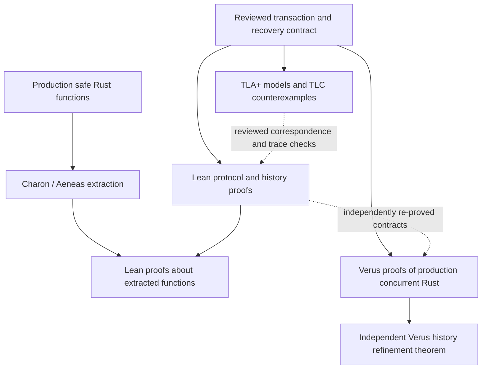

# Formal verification plan

Design date: 2026-09-23. Code baseline: `aa2f2c374e221dbcdd12069b91be3ed826291d98`.

This is the full verification roadmap. Its first executable component pilot now lives in the [verification workspace](../verification/README.md): actual Rust helper proofs, an extraction bridge, protocol/resource model campaigns, and a guarded performance experiment. The [claim ledger](../verification/claims.toml) and fresh run receipts distinguish those results from open engine obligations. P1's complete concurrent-slice refinement and the later whole-engine milestones remain unfinished; a passing component campaign does not satisfy those exit conditions.

The program has two goals: establish the database's correctness, and create a verified environment for aggressive performance experiments. Each candidate implementation must preserve a stable public contract and carry evidence tied to its exact source and build configuration. Section 13 defines that experimentation workflow.

Implementation checkpoint, 2026-09-23: the workspace now contains both production bucket variants with independent Verus and extracted-Rust Lean proofs, complete result equivalence, fixed-4096 production corollaries, and a proved scalar stamp comparison. The acceptance workflow rebuilds and independently replays Lean's complete environment, audits theorem types/axioms, requires semantic and forged-proof negative controls, and checks a frozen engine/contract boundary. Thirty-five TLA+ cases cover publication, crash-ordering candidates, retention, collector priority, and live-key reclamation. The experiment records component timing and allocation use and runs the existing extended Crucible under all three bucket configurations.

This does **not** close P1's actual concurrent-operation/slice-refinement obligation, the parameterized transaction-history invariant, or the complete-engine milestones. Later resource and durability modeling has begun in parallel; its abstract results do not prove or repair the corresponding Rust implementations. The initial source baseline is explicitly unanchored until independently reviewed and committed. No candidate has been promoted, and the full verification gate remains closed.

The [initial evidence archive](bench_data/verification_pilot_2026-09-23/README.md) retains the successful composed run, proof/model diagnostics, integration matrix, and timing/allocation results.

## 1. Recommended architecture

Use **TLA+/TLC to explore concurrent executions, Lean to prove the general transaction and reclamation mathematics, Aeneas/Charon to connect actual safe Rust functions to Lean, and Verus to verify the concurrent Rust implementation**. Start with one complete transaction slice before scaling to the whole core.

Verus is a Rust verification system using its own specifications and SMT-based proofs. It is not a documented general importer of Lean theorems. Aeneas provides the more direct connection: Rust is extracted through Charon into definitions that Lean can reason about. Its current supported subset excludes the unsafe/concurrent implementation that dominates the storage layer. [Verus guide](https://verus-lang.github.io/verus/guide/), [Aeneas support and limitations](https://github.com/AeneasVerif/aeneas).

The practical bridge runs **from production Rust into Lean**, where we prove that the extracted behavior implements our specification. We do not need to generate the database from Lean. Current hax can orchestrate the Charon/Aeneas Lean pipeline; it is a frontend option, not an independent solution to unsupported unsafe code. [hax architecture](https://hax.cryspen.com/dev/architecture/).

Use two independent deductive chains rather than inventing a Lean-to-Verus translator:

1. **Lean chain:** prove a parameterized protocol correct; prove extracted production functions implement its pure decisions.
2. **Verus chain:** prove the actual concurrent Rust operations implement a sequential transaction specification, re-establishing the necessary protocol invariants and history theorem inside Verus. Do not assume the Lean result through an unchecked foreign theorem.

The second chain is a substantial feasibility-gated objective. A collection of verified functions is insufficient: the implementation theorem must connect complete executions to legal transaction histories. If the tools cannot establish that theorem for the selected code, the reported result remains partial.

For performance experiments, use the production implementation proof as the acceptance gate: Verus for the covered concurrent core, and extracted-function Lean proofs for their covered safe functions. Standalone Lean protocol proofs and TLC runs provide additional design evidence; they cannot authorize an otherwise unproved Rust change. The current plan does not establish whole-engine Rust-to-Lean or Rust-to-TLA+ refinement. A mechanically connected three-language specification would require additional correspondence work. Independent Verus implementation/history proofs can provide a useful optimization gate without that connection, provided their own contracts fully express the accepted requirements.



These are planned relationships. Dashed edges are not proof transport. Extraction, verifier frontends, compiler behavior, and external primitive contracts remain explicitly identified trust boundaries.

Keep TLA+ outside the deductive proof dependency chain. Its independent executable model is valuable for finding missing cases without first constructing a verified TLA+-to-Lean compiler. TLC explores specified finite instances; the arbitrary-size/arbitrary-finite-execution safety theorem comes from induction. [TLA+ tools](https://lamport.azurewebsites.net/tla/tools.html).

## 2. What we intend to establish

The application target is one host running multiple HyperFeed-style workers against one shared transactional store. Separate processes on that host remain in scope: different mmap addresses, worker lifetimes, and process-shared ownership matter even without remote workers. The specification uses the [published-workload research](extended_crucible_research.md) and [Extended Crucible contracts](extended_crucible.md); it cannot certify compatibility with unavailable HyperFeed application code.

### Transaction contract

The principal target is **strict serializability of successful committed transactions through the covered `OccTable` API**: there is a serial execution producing the same reads, query results, and writes, preserving real-time precedence between nonoverlapping transactions. This is a target to prove, not an assertion that the current implementation already satisfies it.

Specify the following before writing proofs:

| Area | Required semantics |
| --- | --- |
| Database | A finite mapping of physical slots to logical row values; explicit live, logically deleted, and physically absent states |
| Transactions | Begin, reads, predicate queries, writes, savepoints, rollback, abort, commit, and resource/serialization errors |
| Indexes | Derived relations over logical rows using a deterministic extractor per index |
| Predicates | Complete Eq, In, and range results, including empty results and pending writes; defined numeric/string ordering |
| Historical lookup | Return a complete result for the permitted snapshot or reject with a retry; retaining all historical index postings is not required |
| Publication | A successful transaction's entire write set becomes logically committed together; overlapping readers may wait or retry |
| Savepoints | Restore pending values and own-write query behavior; retained read dependencies may cause conservative retries |
| Failure | Distinguish clean abort/retry, allocation failure before publication, poisoned partial state, and failure after visibility but before WAL acknowledgement |
| Queries | `StrictSnapshot` returns only validated results; `ChunkedEventual` has a separate per-chunk contract |
| External effects | Application output and acknowledgements are associated with successful commit; a retried transaction cannot undo arbitrary external effects |

Use a history containing invocation, read/result, logical publication, commit response, WAL enqueue/write/flush, durable acknowledgement, crash, and recovery events. A transaction that becomes visible but whose caller receives a later WAL error cannot simply disappear from the history as an ordinary abort. Pending operations at crash may require completion in the abstract history.

Do not choose transaction-ID order or response order as the serialization witness without proving it. Begin identifiers and publication stamps serve different purposes. Opacity—consistent observations even for transactions that later abort—is a separate stronger claim. Audit what the API permits a caller to observe before validation; either prove that claim separately or document that speculative results cannot drive irreversible effects.

### Scope and exclusions

- Cover the production [`OccTable` implementation](../aerostore_core/src/occ_partitioned.rs), bound indexes, ProcArray, row locking, vacuum, allocator and skiplist ownership, query routes, WAL/checkpoint/recovery, and startup protocol.
- Start with transactions on **one table**. `OccTransaction` does not provide atomic transactions spanning several `OccTable`s.
- Specify physical allocation/seeding as quiescent bootstrap. Current logical insertion and deletion can update preseeded rows. `read(None)` does not record an absent physical-slot dependency; allowing concurrent physical insertion would require a new dependency mechanism. Enforce bootstrap-only mutation on every supported route, including unindexed tables.
- Raw index traversal is a diagnostic API without transactional completeness guarantees. Legacy `MvccTable`, `QueryEngine`, and older WAL/recovery paths require their own coverage entries; they do not inherit the production proof.
- Treat Tcl/FFI as an integration boundary initially. Include its retry, lifecycle, and durability behavior in conformance tests; full C/Tcl memory-safety verification is outside this program's first release.
- Exclude remote-worker protocols, replication, full PostgreSQL SQL compatibility, arbitrary user callbacks, and unmodeled hardware failures.

### Durability contract

Prove volatile concurrency and crash recovery separately, then compose them through the history specification:

1. **Synchronous acknowledgement:** every acknowledged transaction survives a supported crash/restart, with its dependencies, unless a later committed transaction legitimately supersedes its values.
2. **Asynchronous acknowledgement:** recent transactions may be lost, but recovery preserves transaction atomicity and a dependency-closed committed history. Choose a prefix of an explicit commit/log sequence as the implementation contract; do not use transaction start IDs as log positions.
3. **Checkpoint/replay:** recovery equals applying a consistent checkpoint and the required suffix of complete WAL transactions. Replaying the same durable inputs is deterministic; rebuilding indexes produces the relation derived from recovered rows.
4. **Failure reporting:** corruption, unsupported layouts, and unrecoverable state fail explicitly. Decide and test whether an incomplete trailing record is discarded or causes recovery failure; do not silently discard corruption in the middle of the log.

Asynchronous commit permits recent loss, not an inconsistent recovered database. PostgreSQL makes this distinction explicitly. [PostgreSQL asynchronous commit](https://www.postgresql.org/docs/16/wal-async-commit.html).

## 3. Obligations grounded in the current code

The engine obligations below remain **open** unless an exact implementation theorem is listed in the claim ledger. Existing tests and finite models are supporting evidence. The [transactional-index guide](transactional_indexes.md) describes the repaired protocol; the [current validation archive](bench_data/transactional_indexes_2026-09-22/README.md) supplies the regression/performance baseline.

| ID | Obligation and source | Principal proof/test target |
| --- | --- | --- |
| TX-01 | Registration, snapshot capture, and deregistration in [`procarray.rs`](../aerostore_core/src/procarray.rs) and `occ_partitioned.rs` | Every snapshot has a coherent active set and retention horizon |
| TX-02 | `index_lookup`, publication buckets and stamps in [`shm_index.rs`](../aerostore_core/src/shm_index.rs) | Empty and nonempty predicates are complete or rejected; post-capture changes invalidate commit |
| TX-03 | Index change preparation and `commit_with_record` | All row/index changes become observable consistently; late older writers still invalidate readers |
| TX-04 | Concrete read/write validation, pending writes, savepoints | Read-your-writes, conflict handling, rollback, and committed-history refinement |
| TX-05 | `bind_index`, shared registry, seeding and attachments | Complete index set, identical extractors, correct initial postings, no runtime bypass |
| MEM-01 | Version chains, `RowLockGuard`, [`vacuum.rs`](../aerostore_core/src/vacuum.rs) | No reuse while a snapshot, cursor, or guard can dereference storage |
| MEM-02 | [`shm_skiplist.rs`](../aerostore_core/src/shm_skiplist.rs) | Ordered reachable structure; correct posting set; no detached-predecessor publication or double ownership |
| MEM-03 | [`shm.rs`](../aerostore_core/src/shm.rs) | Typed initialized allocations, bounds/alignment, lifetime/provenance, pool conservation |
| MEM-04 | Horizon advancement and collector scheduling | Safe eventual reclamation and conditional retained-memory bound |
| CON-01 | [`shm_lock.rs`](../aerostore_core/src/shm_lock.rs), all lock nesting | Mutual exclusion, publication ordering, cleanup and absence of lock cycles |
| CON-02 | Counter/tag allocation and finite process slots | No sentinel collision, unsafe wraparound, slot leak, or unhandled exhaustion |
| QRY-01 | [`execution.rs`](../aerostore_core/src/execution.rs), [`rbo_planner.rs`](../aerostore_core/src/rbo_planner.rs) | Index, PK, and full-scan routes implement the same logical query contract |
| DUR-01 | [`wal_writer.rs`](../aerostore_core/src/wal_writer.rs), [`wal_ring.rs`](../aerostore_core/src/wal_ring.rs) | Visible commits, durable order, dependency closure, framing, ring ownership |
| DUR-02 | Checkpoint/truncation and [`recovery_delta.rs`](../aerostore_core/src/recovery_delta.rs) | Consistent durable cut, complete atomic replay, valid delta baselines |
| DUR-03 | [`wal_delta.rs`](../aerostore_core/src/wal_delta.rs), [`wal_logical.rs`](../aerostore_core/src/wal_logical.rs) | Codec round trips, checked lengths, valid byte representation, corruption handling |
| LIFE-01 | [`bootloader.rs`](../aerostore_core/src/bootloader.rs), [`shm_tmpfs.rs`](../aerostore_core/src/shm_tmpfs.rs) | Exclusive initialization/recovery, safe ordinary attachment, layout and arena identity |
| APP-01 | [`aerostore_tcl/src/lib.rs`](../aerostore_tcl/src/lib.rs), Extended Crucible adapter | Correct use of bindings, retries, postcommit errors, outputs and restart |

Several implementation details require explicit investigation or repairs before their proof obligations can close:

**Machine arithmetic and capacity.** Current transaction/publication allocation uses unchecked `u64` increments with zero reserved. Skiplist stack tags use finite widths. Define fail-closed exhaustion or prove a safe wrap scheme; an idealized Lean natural number is insufficient. ProcArray has 256 slots shared by application transactions and temporary index epoch registrations. Nested acquisition must have capacity, reserved resources, or a proven graceful failure path. Current indexes have 4,096 publication buckets and bounded acquisition uses 4,096 attempts; neither number is a mathematical cutoff for safety.

**Unsafe API and payload validity.** `RelPtr::from_offset` and `as_ref` are public safe functions, but bounds/alignment alone do not prove that the target is initialized, has the right type, or remains alive for the returned reference. Design allocation/borrow/pin capabilities and tighten the API. `Copy + Send + Sync` does not imply a pointer-free, process-independent byte representation. Audit raw-byte delta calculations, including padding in `coarse_dirty_mask_for_copy`; use an explicit representation contract or fieldwise encoding. Do not assume these properties simply to make a proof pass.

**Lifecycle authority.** `open_boot_context` clears orphaned slots on warm attachment, while `clear_orphaned_slots` requires prior workers to have stopped. Separate exclusive restart/recovery authority from ordinary live worker attachment and enforce the distinction. A valid header alone does not establish a safe recovery state.

**Durability ordering.** `OccCommitter::commit` publishes through `commit_with_record` before encoding or submitting WAL. Checkpoint code captures rows, then samples the global identifier, writes/renames/syncs a checkpoint, and truncates WAL. A process-local Tcl mutex does not by itself establish exclusion across independent processes. These facts create concrete schedules to model; this plan does not claim to have reproduced a crash anomaly.

**Extractor identity.** Bound attachments must agree on a pure, deterministic extractor. An offset registry does not prove equality of callback bodies. Prefer schema/extractor identities with verified built-in functions; define panic, reentry, and error behavior. Tests of matching hashes alone do not prove semantic equivalence.

## 4. TLA+ models and counterexample campaign

Write explicit small-step TLA+ modules. PlusCal is optional if the generated actions remain easy to map to code. Split every interleavable publication, allocation, and persistence event; do not represent the implementation as one atomic `Commit` action.

### TransactionPublication

State includes transactions and phases, snapshots, active registrations, pending writes, row heads and versions, index postings, publication locks/stamps, predicate/read dependencies, savepoints, allocation outcomes, and poison state.

Model at least these distinct actions:

1. Reserve/register and capture the snapshot under the lifecycle protocol.
2. Select and acquire lookup buckets; inspect stamps and retain dependencies, including an empty lookup.
3. Capture candidate IDs; release bucket guards; materialize visible rows and overlay own writes.
4. Prepare final writes/index deltas; acquire canonical index and row lock sets.
5. Validate predicate stamps, concrete reads, and write bases.
6. Allocate/insert destination postings individually, with failure after any successful insertion.
7. Roll back prepared destinations on failure; separately model failure of rollback itself.
8. Remove sources individually; publish row heads individually while the writer remains registered.
9. Deregister; obtain a fresh publication stamp; stamp each changed bucket; release guards.
10. Respond, abort, clean up, or poison after an unexpected partial failure.

The invariant is **consistent observation or rejection**, not physical row/index equality during every guarded intermediate state. Include non-key updates, repeated keys, disjoint keys sharing a bucket, broad predicates, key movement A→B→A, and savepoint rollback after a predicate read.

### SnapshotReclamation and StorageOwnership

Model a snapshot's active set and independently pinned horizon, version links, reader cursors, row guards that outlive commit, retire lists, free lists, reuse, and ownership transfer. Include a lookup that releases bucket guards before materialization while a writer moves the key and vacuum runs.

For the skiplist, start with a single ordered list and posting relation, then prove a refinement for towers: upper levels are valid subsets of the bottom level, searches cannot lose reachable matching nodes, and mutations cannot attach new nodes to retired predecessors. Include node/posting allocation failure, detached nodes, reuse, and finite ABA tags.

Include sustained insertion/removal of individual postings while their key node remains live. Reclaiming only empty key nodes misses that leak. Track postings, spill blocks, tower allocations/lanes, and row versions separately; extend beyond the current structural census where it omits payload spills, padding, or row storage.

Check that old snapshots pin everything they actually need, new snapshots do not inherit obsolete retention horizons, guards prevent reuse, and retired memory can become free once all real blockers finish.

### DurableCommitRecovery

State distinguishes volatile rows, prepared log entries, enqueued records, written bytes, flushed bytes, checkpoint contents, durable directory entries, log cuts, acknowledgements, and recovery state. Model short writes, torn tails, writer failure, ring saturation, independent appenders, and crash at every persistence boundary.

The first candidate execution to investigate is:

1. T1 publishes A and pauses before WAL submission.
2. T2 reads A, commits B, submits and flushes its record, and receives success.
3. Crash occurs before T1's record is recoverable.
4. Recovery retains B without A or its prerequisite history.

Determine whether actual caller coordination forbids this execution. If it does, enforce and prove that coordination. If it does not, repair publication/log ordering or dependency handling. The model must not exclude the execution merely by assigning a single fictional atomic logging action to commit.

Similarly explore checkpoint snapshot → concurrent commit/logging → identifier sampling → truncation. Prefer an explicit durable log position and checkpoint cut; a maximum allocated start ID does not identify the transactions present in a snapshot. A quiescent checkpoint is an acceptable first contract if global quiescence is enforced.

### Bounds and completion reporting

Start with configuration families, not one enormous Cartesian product:

| Family | Initial dimensions |
| --- | --- |
| Predicate/publication | 2–3 transaction actors, 2–3 rows/keys, 1–2 indexes; all-colliding and mixed bucket assignments |
| Historical reads | An older writer, a later reader, a mover/vacuum actor; enough versions to retain and then reclaim history |
| Failure/rollback | Multirow and multi-index writes; capacity sufficient for one destination but insufficient for all; two savepoint levels |
| Ownership | Reader cursor, retained guard, collector, and reuse; both current and stale generations |
| Crash/recovery | Two dependent transactions, one log writer/checkpointer, all modeled crash cuts |
| Integer boundaries | Small machine-width surrogate exercising exhaustion/sentinels; separate proof relating checked arithmetic to production widths |

Record all constants, state constraints, symmetry reductions, depth/commit caps, fairness assumptions, state counts, and runtime/memory limits. Timeouts and out-of-memory are **incomplete**, never passes. A history/ID cap limits execution length even if TLC exhausts the resulting graph. Do not use symmetry that changes ordering-sensitive identifiers or liveness behavior without justification. State constraints can prune reachable continuations. [TLC state constraints](https://lamport.azurewebsites.net/tla/tutorial/session11-1.html).

Reusable finite process slots and an order-preserving epoch abstraction may permit deeper exploration, but the abstraction itself needs a soundness argument. Arbitrary identifier wraparound is not a substitute for it.

## 5. Lean theorem architecture

Define a sequential database specification, a concrete protocol transition system, and a representation/refinement relation. Parameterize row/key domains, finite maps, bucket count, number of processes, and execution length. Separate logical timestamps from machine integers until their correspondence is proved.

The planned theorem dependency order is:

| Stage | Named obligations |
| --- | --- |
| Definitions and initialization | `init_well_formed`, `bootstrap_indexes_match_rows`, `attachment_preserves_authority` |
| Snapshot/visibility | `registration_snapshot_coherent`, `visibility_matches_snapshot`, `retention_horizon_safe` |
| Predicate reads | `bucket_coverage_sound`, `candidate_capture_complete_or_retry`, `validated_predicate_remains_complete` |
| Commit/failure | `publication_observation_atomic`, `savepoint_rollback_preserves_semantics`, `prepublication_failure_preserves_database`, `poison_blocks_further_success` |
| Storage | `step_preserves_ownership`, `reclamation_preserves_observations`, `pool_conservation`, `machine_counters_refine_epochs` |
| Histories | `concrete_step_refines_abstract_step_or_stutter`, `committed_history_strictly_serializable` |
| Persistence | `replay_matches_log_prefix`, `recovery_history_dependency_closed`, `synchronous_ack_survives_recovery` |
| Progress/resources | `acquisition_terminates_or_retries`, `eligible_versions_eventually_reclaimed`, `retained_storage_bound` |

These names describe deliverables; no theorem currently exists under them. Some abstractions may require auxiliary history/prophecy state or a simulation over several steps rather than a simple per-operation linearization point. Choose the simulation that correctly handles overlapping multi-operation transactions, read-only transactions, and pending responses.

Ghost history must be determined or constrained by real transitions. It cannot assume a serial order exists, assume observations are consistent, or drop inconvenient successful transactions. Prove the actual global history theorem after local invariant preservation.

For extraction, prove more than functional equality on ideal valid inputs: arithmetic range checks, invalid-input rejection, termination of bounded helpers, and absence of modeled panics. Every environmental hypothesis must map to an enforced caller check, another theorem, or an explicit external assumption.

### Connecting the TLA+ and Lean models

Give actions, fields, failures, and invariants stable IDs. Maintain a ledger:

`requirement → abstract operation → concrete action → TLA action → Lean theorem → Rust symbol → regression/mutation test`.

Cross-check finite one-step transitions and replay TLC counterexamples through an executable Lean transition checker. Match projected instrumented Rust traces to the same action grammar, allowing justified stuttering and partial orders. Avoid adding synchronization to the tracing path that hides the races under investigation.

These checks detect drift; they do not prove arbitrary model equivalence. The recommended release does not depend on treating TLA+ results as Lean theorems. A verified restricted transition-language translator is an optional later research project, not a prerequisite for obtaining useful proofs.

## 6. Connecting proofs to the production Rust

### Aeneas/Charon: actual safe functions into Lean

Create a small, production-used safe module or crate for pure decisions. Initial candidates are predicate/bucket coverage, snapshot visibility, conflict checks, index deltas, final writes/savepoints, reclamation eligibility, and checked layout arithmetic. Select one candidate based on the extraction pilot; avoid refactoring every subsystem at once.

Requirements:

- The engine calls the proved function. A rewritten verification-only version does not satisfy coverage.
- Extract the exact feature/target configuration used by the engine; record source and generated-artifact hashes.
- Pin compatible Rust, Charon, Aeneas, Lean, and library revisions. Keep verification toolchains separate from the production compiler when necessary.
- Regenerate definitions in CI; never hand-edit generated functions to make a proof work.
- Inventory every external model introduced during extraction. Do not replace the function being proved with an axiom.
- Prove the named contracts and their required totality/panic properties. Successfully extracting code or running `lake build` does not itself establish them. [hax Lean quickstart](https://hax.cryspen.com/manual/lean/quick_start/).

### Verus: actual concurrent operations

Use executable code compiled into production, with specification/ghost code erased by the supported toolchain. Prefer small verified modules and adapters over a second implementation. Check that normal builds, proof builds, and tested builds execute the same covered logic; review configuration and macro expansion differences.

Verify in this order:

1. Checked offsets/layout, bounded loops, canonical lock sets, and simple ownership transfers.
2. Snapshot registration, publication lock/stamp operations, and one complete lookup/commit race.
3. Commit orchestration, rollback, poison transitions, and row/version ownership.
4. Arena/free-list and skiplist mutation/reclamation.
5. Query routing and durable commit/checkpoint/replay operations.
6. The implementation-level history refinement theorem, using the proved contracts above.

Re-prove in Verus the helper lemmas and protocol results needed by its theorem, including the actual helper bodies against their contracts. A successful Aeneas/Lean proof does not authorize assuming that helper's Verus contract through `external_body`. This intentional overlap avoids a magical import of Lean proofs. If a helper must be built from proof-erased Verus code before Aeneas extraction, first establish that the extraction pipeline supports that exact output and record erasure in the trusted toolchain.

An early result may verify a shell assuming storage contracts. Label it **conditional verification of that shell** until the storage implementations meet those contracts. Moving the main transaction, allocation, or reclamation algorithm into `external_body` does not complete its verification. Verus explicitly exposes such trust mechanisms. [Verus assumptions and trusted components](https://verus-lang.github.io/verus/guide/tcb.html).

### Weak memory and process-shared mappings: mandatory feasibility gates

Aerostore uses Acquire/Release/AcqRel/Relaxed atomics. Verus's current documented `atomic_ghost` library provides sequentially consistent atomics. Therefore an SC Verus proof does not automatically cover existing memory orderings. [Verus atomic ghost library](https://verus-lang.github.io/verus/verusdoc/vstd/atomic_ghost/index.html), [atomic wrapper implementation](https://github.com/verus-lang/verus/blob/main/source/vstd/atomic.rs).

The pilot must choose and record one route:

- Prove that the actual weaker-ordering primitives implement the specified abstract atomic operations in a suitable memory semantics, with a checked connection to the higher proof.
- Adopt supported SC primitives for the covered implementation, then re-run throughput, tail-latency, and memory gates before accepting the change.
- Retain a narrow, reviewed primitive contract as an explicit assumption and limit the claim accordingly. This is useful progress but leaves the weak-memory implementation obligation open.

Do not silently strengthen orderings in the model or weaken production preconditions to pass verification. Loom remains complementary bounded evidence, not the missing unbounded refinement proof.

Likewise, two independently attached handles must denote **one arena and one ownership authority**, even when their virtual addresses differ. An attachment cannot mint a second permission to the same bytes. Model physical arena identity plus offsets, lifetime/generation, alignment, process-shared atomic behavior, and exclusive recovery. A Rust thread proof alone does not establish the OS/mmap process-sharing contract.

Public safe wrappers must enforce requirements for unverified callers; proof-only preconditions do not constrain ordinary Rust or Tcl callers. Audit exposed APIs and use the verifier's applicable safe-API checks. [Verus conditional memory safety](https://verus-lang.github.io/verus/guide/memory-safety.html).

### When could a direct Lean-to-Verus bridge make sense?

Only if duplicated proof maintenance becomes a measured bottleneck and the shared logical fragment is small. Then specify a restricted contract language, give it checked semantics, and establish a semantics-preserving translation or certificate checker for both sides. Include integer widths, partial functions, heap/ownership meaning, and temporal/history interpretation.

Generating two similar-looking contracts, comparing hashes, or solving both with SMT is not that proof. SMT proof reconstruction into Lean can reduce trust for supported logical queries, but does not establish Rust translation or specification correspondence. Keep such work off the initial delivery path. [Lean-SMT project](https://github.com/ufmg-smite/lean-smt).

## 7. Progress and the original runtime-degradation failure

Functional correctness alone cannot rule out a system that steadily retains memory or retries almost every transaction. Add separate conservation, progress, and space obligations:

1. Every allocation is reachable live storage, explicitly retired/pinned storage, bounded in-flight preparation, or available free storage. No allocation disappears from accounting or belongs to two owners.
2. A version remains pinned only for an actual snapshot/guard obligation. New readers do not perpetuate an obsolete horizon after its original blockers finish.
3. Eligible retired objects eventually return to the appropriate allocator under justified collector admission, fair scheduling, and finite critical sections.
4. Local bounded lock acquisition returns success or retry. Canonical ordering covers the complete lock hierarchy, including lifecycle, index, row, allocator, and collector locks.
5. Space usage has a bound derived from live data, retained history, in-flight work, fixed metadata, and allocator fragmentation.

A useful target inequality is:

`used bytes ≤ live bytes + retained-history bytes + in-flight bytes + fixed metadata + fragmentation bound`.

To turn this into an arena-size guarantee, also bound mutation volume during the maximum pin/collection delay, live set size, concurrent transactions, row guards, and size-class slack. Prove an event-count bound first; any translation to seconds depends on measured or assumed workload and service-rate bounds. A forever-pinned reader or a dead collector invalidates a finite-memory progress promise.

This accounting initially bounds shared-arena bytes. Specify separate capacity/backpressure bounds for the WAL ring and process-local pending buffers before making a total-memory claim.

Safety theorems do not need fairness. Liveness theorems must list fair scheduling, worker survival, finite transaction/guard lifetimes, and resource availability. Do not promise starvation freedom for every transaction under adversarial hot-key contention. Process death while holding a nonrecoverable shared lock may require exclusive recovery.

Fair scheduling alone does not guarantee winning a contested CAS lock. Model the production collector's priority-waiter registration and the foreground path's post-acquisition priority recheck. Prove collection can proceed while foreground requests continue indefinitely, including the registration/acquisition race. State whether one collector exists per lock or what fairness is required among multiple priority contenders. Removing priority admission or its necessary recheck must invalidate the corresponding progress/admission argument. This directly addresses the collector starvation described in the [earlier repair report](sustained_churn_correctness.md).

Connect these results to implementation resource accounting, not just its transaction history. A history refinement can hide leaked allocations or infinitely many internal steps. Prove that concrete allocation/retirement/reuse events preserve the abstract accounting, and that the implementation simulation preserves the stated progress/fairness premises, with a well-founded argument for internal work where needed. Re-establish these obligations in Verus for the covered implementation, or explicitly retain an abstract/conditional resource claim. A Lean space theorem plus a Verus transaction-history theorem alone does not close this gap.

This is the part that could have exposed the earlier runtime degradation: model the horizon propagation and reclamation rules, then demonstrate that eligible memory eventually becomes reusable. Serializability proofs alone would miss a retention leak. Keep sustained Crucible checks for throughput, update p99, retry rate, reclaimed bytes, high-water memory, and WAL backlog because scheduling costs and real-time performance remain empirical.

## 8. Negative controls and non-vacuity

Every important repaired bug gets a model mutation and, where practical, a mutation of the covered Rust/helper implementation. A mutation is accepted only when it produces the intended counterexample or fails the relevant theorem; a parse error or timeout is not detection.

Required negative controls:

- Omit an empty predicate dependency or post-capture validation.
- Publish rows without protecting corresponding index changes.
- Let an old snapshot silently use incomplete current postings.
- Stamp with the writer's begin ID, or stamp before deregistration.
- Remove sources before all destination allocations succeed; omit rollback cleanup.
- Drop necessary savepoint read dependencies or a registered index.
- Recursively inherit old retention horizons; vacuum using active IDs alone.
- Recycle storage while a reader cursor or row guard still refers to it.
- Reclaim only empty key nodes, leaking removed postings under a permanently live key.
- Disable collector priority admission or the foreground priority recheck during continuous churn.
- Publish from a detached skiplist predecessor or duplicate free-list ownership.
- Permit counter sentinel reuse, mismatched key encoding, or duplicate ownership on attach.
- Recover a dependent commit without its prerequisite; truncate beyond a safe durable checkpoint cut.

Also require positive witnesses: disjoint writers can both commit; empty-search conflicts are reachable; own-write lookups work; an older reader can complete when no relevant bucket changed; allocation-failure rollback executes; poison is reachable and blocks later success; memory becomes reusable when blockers finish; a crash can recover a nonempty committed history.

An always-aborting implementation, an empty initial-state set, unreachable commit actions, or a theorem quantified over no legal callers must not qualify as success. Review strengthened preconditions and weakened postconditions as changes to the product contract, not routine proof repairs.

Existing [`shm_mutation_model.rs`](../aerostore_core/tests/shm_mutation_model.rs) imports production `ShmMutex`, but models other graph/row/allocator behavior abstractly. Its five models use a preemption bound of two and a branch limit of 10,000. Extend production-primitive coverage and add native predicate/ProcArray scenarios; do not relabel the old suite as coverage of the new protocol.

## 9. Trust and coverage ledger

Each claim records scope, exact source revision/features, theorem or model entry point, bounds, assumptions, evidence, and outstanding dependencies. Suggested states are `planned`, `modeled`, `model_checked`, `abstract_proved`, `rust_proved_conditional`, `rust_proved`, and `out_of_scope`. Tests are separate evidence attached to a claim, not a higher proof state.

Maintain these trust categories explicitly:

| Boundary | Required treatment |
| --- | --- |
| Lean logic/kernel and dependencies | Pin versions; inspect transitive axioms; review the meaning of the theorem and imported definitions |
| Charon/Aeneas and external models | Record translator revisions, Rust/MIR assumptions, supported subset, every modeled dependency |
| Verus/SMT/vstd and erasure | Pin verifier/solver/library; list trusted specifications and external bodies; confirm production compilation path |
| Rust compiler/LLVM | Record target/compiler/features; compiler correctness remains trusted |
| OS, CPU, mmap | State supported architectures, alignment/coherence/atomic assumptions, arena identity, process lifecycle |
| Storage | State write/flush/rename/directory persistence guarantees and supported crash model |
| FFI and application callbacks | Enumerate caller obligations, runtime checks, extractor identities, effects and retry boundaries |
| Model correspondence | Distinguish reviewed/differentially checked connections from proved refinement |

All formal results are relative to some trusted base. However, an unproved copy of the transaction algorithm, allocator, or weak-memory protocol must not be hidden as an ordinary OS assumption. Track it as an open obligation and narrow the claim.

Lean CI must inspect theorem dependency closures for `sorryAx`, unexpected axioms, and native-evaluation trust. Allow standard logical axioms deliberately; do not demand a meaningless zero-axiom count. Require proof-root imports and exact named theorem types, so deleting a theorem import cannot turn an incomplete project green. Recheck release proof objects with a supported independent kernel-checking workflow where feasible. [Lean proof validation](https://lean-lang.org/doc/reference/latest/ValidatingProofs/).

Verus CI similarly inventories `assume`, `admit`, trusted/external bodies and function specifications, disabled verification, and proof-relevant configuration. Keyword checks are a first filter, not a semantic audit. Core obligations cannot be discharged by adding an assumption of their own conclusion. [Verus proof-review guidance](https://verus-lang.github.io/verus/guide/llmforverusproof.html).

## 10. Proposed repository structure and reproducibility

The following paths are proposed deliverables, not files already present:

```text
verification/
  README.md                 # commands, scope, current claim status
  claims.toml               # requirements/actions/theorems/source/test mapping
  assumptions.toml          # trusted boundaries and unresolved obligations
  toolchains.lock           # exact versions, commits and artifact checksums
  tla/
    TransactionPublication.tla
    SnapshotReclamation.tla
    StorageOwnership.tla
    DurableCommitRecovery.tla
    configs/
    negative/
  lean/
    Aerostore/Spec/
    Aerostore/Protocol/
    Aerostore/Refinement/
    Aerostore/Recovery/
    Aerostore/Resources/
    Aerostore/Implementation/
  verus/                    # proof roots/adapters for production-used modules
  bridge/                   # extraction manifests and correspondence checks
  traces/                   # minimal counterexamples and replay fixtures
  experiments/              # candidate manifests, proof evidence, comparisons
    profiles/               # reviewed workload and acceptance configurations
scripts/
  verify_formal.sh           # one reproducible entry point, explicit profiles
  check_formal_coverage.py
```

Keep pure production logic in a production module/crate, not exclusively under `verification/`. Place generated Lean definitions where the chosen extraction tooling expects them, with explicit references from the proof workspace. Select the exact structure at the pilot after confirming tool compatibility.

CI profiles:

| Profile | Required work |
| --- | --- |
| Pull request | All accepted Lean/Verus proof roots, extraction freshness, assumption/coverage diff, completed small TLC configurations, selected negative controls, focused production tests/Loom |
| Nightly | Larger TLC families, all negative controls, extended Loom/process-attachment schedules, crash injection, Extended Crucible and sustained resource/performance checks |
| Release | Clean pinned builds, complete declared campaign, theorem/axiom report, model bounds/state counts, source/artifact hashes, supported platforms and reviewed trust ledger |

Do not skip formal checks just because a change is outside a file-level allowlist: changes in types, macros, dependencies, features, layouts, and callers can invalidate proof premises. Initially run the complete accepted proof suite; optimize only after a dependable dependency map exists.

Exact CLI commands and tool pins are pilot deliverables. Do not publish untested commands or invented version compatibility as an established workflow. Keep solver/model resource limits in configuration and archive incomplete runs separately.

## 11. Delivery phases and acceptance gates

This is a substantial verification and likely refactoring project. Toolchain feasibility and the proof boundary determine the later effort; a firm whole-engine schedule before the pilot would be misleading. Use small reviewable changes and evidence-based gates.

| Phase | Concrete deliverables | Exit condition |
| --- | --- | --- |
| P0: Contract and baseline | Scope/claim ledger, sequential history spec, source map, lock graph, durability modes and assumed platforms; retain current regressions and benchmark evidence | Every public covered path has a defined success/error contract; no claim silently includes legacy APIs or multitable transactions |
| P1: Toolchain and complete-slice pilot | One publication/empty-predicate TLA+ model; a parameterized Lean invariant; two production helper variants and their refinement proofs; one Verus concurrent operation and slice refinement; explicit mmap/atomic boundary | Reproducible pinned build and candidate comparison; intended mutants rejected; engine uses proved code; the Verus operation's events refine the slice specification under enumerated primitive/storage contracts; unsupported semantics clearly identified |
| P2: Native transaction protocol | Full predicate/publication, ProcArray, savepoint/failure models; Lean history refinement; expanded real primitive tests | Required TLC families finish; old bug variants fail; arbitrary finite-history theorem covers successful transactions under stated storage contracts |
| P3: Storage implementation | Typed arena/payload APIs, ownership and reclamation proofs, skiplist refinement, machine counters/capacity, lifecycle repair as needed | No unresolved core ownership/pointer obligation hidden in external bodies; chosen weak-memory/process boundary is justified and reported |
| P4: Durability and restart | Commit/log ordering, ring/codec proofs, checkpoint cut, replay/index rebuild, coordinator recovery contract | Dependency-closed recovery and sync acknowledgement theorem; systematic modeled and real crash-cut tests agree |
| P5: Query/application and composition | Query-route equivalence, complete Verus implementation/history theorem, Tcl contract tests, Lean extracted-function coverage | End-to-end theorem for the declared core, with only enumerated primitive assumptions; no unproved Lean-to-Verus transfer |
| P6: Resources and release | Conditional progress/space proofs, implementation resource/progress correspondence, whole coverage audit, independent review, sustained workloads | Stated resource bound applies to concrete allocation behavior under explicit premises; regression/performance gates pass; reproducible release evidence and accurate claims |

P2 and early P4 modeling can proceed in parallel once P0 defines semantics. Begin crash-ordering investigation during P1/P2, before proof structure hardens around a potentially wrong commit protocol. P3 implementation proofs depend on stable protocol contracts; P5 composition depends on the relevant P2–P4 results. Develop resource invariants throughout P2/P3 rather than postponing retention questions until release.

The pilot is deliberately demanding enough to reveal tool limits. It must demonstrate ordinary Rust compilation from the covered source, a meaningful functional proof about extracted code, proof failure after a semantic mutation, and a Verus result whose assumptions match the actual atomic/mmap interface. A toy counter disconnected from Aerostore is insufficient.

If Aeneas cannot handle a proposed function, first simplify that production boundary without changing behavior. If Verus cannot cover required memory/process semantics, narrow its immediate role and keep the implementation obligation open while continuing the protocol and safe-core work. Do not spend the main project effort developing a general verifier bridge by default.

Prefer re-proving the necessary protocol results in Verus over introducing an unchecked cross-system theorem import. If that full history theorem proves infeasible, publish the useful component proofs with their exact scope; the “verified core” exit condition has not been reached.

Proof-driven code changes must retain the current Crucible correctness gates and be benchmarked when they affect locking, layouts, allocation, or WAL. Report throughput and update tail latency separately. Layout/ABI changes require explicit versioning and recovery compatibility; a proof refactor is still a storage-format change when it changes shared bytes.

## 12. Definition of completion and first implementation step

The verification program is complete for a declared release only when:

1. The transaction, recovery, and resource contracts are precise and traceable to production APIs.
2. Lean proves the parameterized protocol/history and resource results with audited dependencies.
3. TLC completes the declared configurations and detects the required bad variants.
4. Actual production safe functions are extracted and proved against the Lean contracts.
5. Actual concurrent production code has the required Verus contracts and history refinement, plus implementation resource accounting and progress correspondence, with every remaining primitive assumption visible.
6. Memory ordering, mmap authority, unsafe payload/pointer validity, integer limits, startup, and crash persistence have justified boundaries; unsupported core obligations are not called complete.
7. Fault injection, process tests, query/Tcl tests, and both Crucibles agree with the specified behavior and retained performance/resource gates.
8. A clean checkout reproduces the evidence for the exact covered configuration, and documentation distinguishes verified core behavior from unverified integration or application compatibility.
9. The experiment workflow rechecks current implementation proofs against the fixed contract, rejects a deliberately incorrect candidate for the intended reason, and compares correct variants using unchanged performance/resource gates. Acceptance of a measured improvement is recorded separately from establishing that workflow.

The first implementation should be **P0 plus the P1 native predicate/publication slice**: two workers perform an empty indexed lookup and attempt conflicting creation, alongside a reader racing a key move. Include registration, candidate capture, validation, destination preparation, row publication, deregistration, and stamping. Extract the production predicate bucket-set calculation described in section 13, prove both candidate variants in Lean, and verify a real publication operation in Verus under explicitly declared primitive contracts.

In parallel, model the visibility-before-WAL and checkpoint-cut schedules. This produces immediate evidence about the highest-risk remaining semantics while determining whether the proposed Rust proof boundary is practical. Expand only after the slice checks the actual implementation relationship as well as the abstract algorithm.

## 13. Verified performance experiments

The aim is to change implementation choices freely within proved boundaries, then measure which changes improve the single-host HyperFeed workload. Correctness remains a constraint on the search. Verification does not predict hardware performance or automatically supply a proof for a new algorithm.

### Stable contract, replaceable algorithm

Separate three layers:

1. **Public contract:** permitted transaction histories, errors/retries, durability, memory safety, conditional progress, resource limits, and environmental assumptions.
2. **Candidate protocol:** index structure, bucket scheme, lock hierarchy, publication stages, allocation/reclamation rules, batching and log coordination.
3. **Candidate implementation:** exact production Rust and the proofs connecting it to the contract.

Freeze the first layer for an experiment, not the current 4,096 buckets, mutation lock, stamp scheme, or WAL ordering. An optimization may replace the protocol, internal invariants, proof structure, or data representation. It must re-establish the same public guarantees. A changed external contract is a separate versioned design decision and cannot be scored as an improvement under the old experiment profile.

The protected contract includes its transitive definitions and caller/environment premises, not just theorem names. The candidate cannot gain acceptance by weakening postconditions, strengthening caller requirements, reducing durability, shortening the assumed reader lifetime, excluding difficult inputs, or adding trusted bodies. Internal lemmas and ghost state may change when their conclusions are genuinely proved. Review proof-only changes as well as executable changes; Verus documents these possible verification shortcuts. [Verus proof-review guidance](https://verus-lang.github.io/verus/guide/llmforverusproof.html).

### Candidate workflow and evidence

```text
Reviewed contract + fixed experiment profile
                    |
        Candidate Rust + supporting proofs
                    |
       Current-source verification and coverage
                    |
      Regression, mutation, and fault checks
                    |
      Repeated baseline/candidate measurements
                    |
          Accept, reject, or report tradeoff
```

Development can explore incomplete or unverified candidates, including running diagnostic benchmarks. Promotion as a verified optimization requires every gate for its declared scope. A failed proof can mean an incorrect candidate, insufficient annotations, or unsupported reasoning; it must be investigated. Solver failure alone is not a counterexample. Similarly, a correct candidate may be slower and should be rejected on performance grounds.

Each `verification/experiments/<id>/manifest.toml` records baseline/candidate revisions; compiler, target and feature flags; contract/assumption/profile identities; changed mechanisms and affected claims; required proof roots and extraction outputs; TLC configurations and mutations; primitive boundaries; workload seeds and resource budgets; and the measured binary's build identity. Bind proof and benchmark artifacts to the same executable source/configuration. Source hashes detect stale evidence but do not prove semantic correspondence.

Re-extract current Rust, rebuild the accepted proof roots, and audit their assumptions. Missing coverage, stale artifacts, disabled proof roots, model-checking timeouts, and unverified changes to a primitive boundary block promotion. Keep the comparison harness and expected contract in the reviewed baseline; an experimental branch cannot validate itself by silently editing its checks. Existing CI protections must themselves be part of the reviewed gate configuration.

Model changes depend on what changed in the implementation. A different pure algorithm may preserve the existing protocol model, but needs a fresh function refinement proof. Changes to publication stages, lock scope, visibility, reclamation, or logging require a reviewed concrete model and renewed implementation refinement. A green TLC run on an obsolete model cannot satisfy that requirement. Cross-model trace checks remain supporting evidence, not a substitute for the Rust proof.

### What may be optimized

| Experiment | Required verification |
| --- | --- |
| Bucket-set construction, encoding, filtering, batching calculations | Current-function equivalence/refinement, arithmetic and error behavior, caller contracts |
| Cache layout, packed representations, allocation pools | Representation, alignment/provenance, ownership, overflow, resource accounting and layout compatibility |
| Shorter critical sections, finer locks, sharded or concurrent index mutation | New interleavings, lock hierarchy, memory ordering, publication and reclamation refinement |
| Predicate tracking or snapshot/version algorithms | Complete-or-retry query semantics, serializable history, retention and progress proofs |
| WAL batching, checkpoint coordination, group commit | Same durability mode, dependency closure, crash cuts and bounded backlog/backpressure |

If weak-memory primitives are assumed rather than proved, freeze their implementation and synchronization contracts within that experiment's trusted boundary. Optimization of their verified callers can continue. Changing an atomic ordering, fence, aliasing rule, or lock primitive requires reopening that boundary and proving the new semantics. An SC proof plus a Loom run does not establish the acquire/release/relaxed implementation theorem. This limitation must be resolved before calling those particular experiments verified.

### Performance acceptance

Preserve correctness and resource gates first. Measure successful committed work and user-visible latency, including retries, queueing and required output/log work. An always-retrying implementation or one that postpones all collection until after timing does not qualify.

Use repeated, interleaved baseline/candidate runs on the same host and record CPU configuration, compiler settings, worker counts, affinity where controlled, arena size, warm-up, workload seeds, and durability policy. Keep the current Crucible correctness/drain checks. Measure transaction types separately as well as aggregate throughput; current evidence already shows why update p99 can move differently from aggregate results.

Required measurements include committed transactions per second; end-to-end p50/p95/p99/p99.9 where sample size supports it; retry/abort rates; no-progress intervals; arena high-water and allocation/reclamation by class; CPU use; and WAL/output backlog and durability lag. Include fixed-arrival-rate runs so queueing cannot disappear merely because a closed-loop client stops offering work while the engine stalls. Compare hot/disjoint keys, contention levels, long-reader limits, tight arenas, and sustained churn.

Prove bounds on concrete allocations, traversals, synchronization steps, and retained objects where practical. Those bounds explain regressions but do not establish a wall-clock latency ceiling without additional platform/scheduling assumptions. Required collector admission and resource proofs remain in force during continuous foreground load.

Fix acceptance thresholds and resource limits before comparison. Accept repeatable improvements satisfying all hard gates; when throughput, latency, memory, and CPU trade off, report the alternatives rather than declare a universal winner. Maximal performance is workload/platform dependent. Under nondeterministic concurrency, compare legal histories and invariants; identical final states are required only when the test's schedule/application semantics make them uniquely determined.

### First optimization pilot

Use `SecondaryIndex::transactional_bucket_ids` in `shm_index.rs` as a candidate boundary alongside the native publication proof. Its current construction sorts and deduplicates bucket IDs. Extract its pure bucket-set calculation and compare that strategy with a bounded bitmap or small-set strategy, preserving canonical key validation, complete Eq/In/range coverage, ascending unique lock order, and errors. Keep the hash, bucket count, and primitive memory orderings fixed for this first experiment.

Both actual production variants must refine the same contract, and the covered concurrent publication caller must retain its proof under the declared primitive/storage assumptions. Deliberately omit a required bucket and confirm that the corresponding proof rejects the mutation. Run existing empty-search, key-move, snapshot, allocation-failure and reclamation regressions, then benchmark short/long `In` lists and contended/uncontended workloads. The alternative may lose; a trustworthy rejection is a successful demonstration of the experiment process.

This initially establishes a verified experiment for a bounded component, conditional on its stated boundaries. It does not certify the whole database. Expand the permitted optimization scope only as implementation, recovery and resource proofs close the corresponding obligations. Later candidates can change lock granularity, index organization, version allocation, reclamation policy and WAL coordination under the same discipline.
