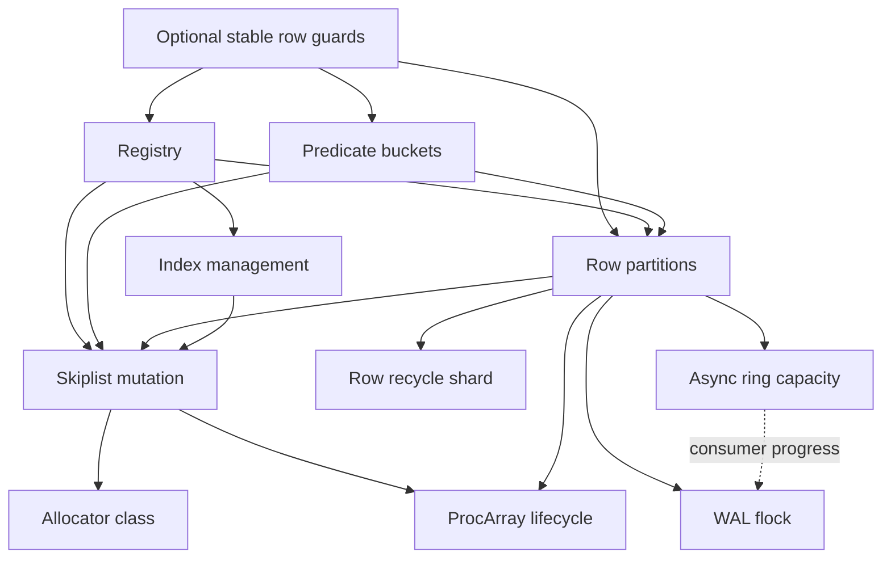

# P0 contract and baseline audit

The [inventory](p0_inventory.json) records the current public API surface and
lock relationships for the single-table target. **P0's scoped contract audit was
accepted on 2026-09-23 against source baseline `4619b8f`.** The integrating
review checked the API success/error contracts, scope classifications and
declared lock relationships against the native transaction, query, publication,
completion and retention paths. Independent integration review also identified
an array-signature scanner defect; its correction and regression are included.

The checker now reports `p0_complete: true` for this accepted contract coverage.
This means the declared scope has defined contracts and a reviewed source/lock
inventory. It does not assert that the implementation satisfies every contract,
close P1's concurrent-slice refinement, or discharge the enforcement and proof
issues recorded below. No runtime source was changed by this audit.

## Scope and exit criteria

The target is one partitioned `OccTable` on x86_64 Linux/WSL2, including workers
attached to the same shared mapping. Physical slots are seeded under exclusive
bootstrap. Runtime logical creation and deletion update those stable slots.
Every handle binds the complete index registry with identical deterministic
extractors. Managed durability uses one selected WAL stream per table. The
required platform, ownership and callback premises remain explicit contracts.

`occ.rs` reexports `occ_partitioned.rs`; it is part of this target.
`ExecutionEngine` and `CompiledPlan` in `execution.rs` also use that table and
are included. The older `occ_legacy`, heap arena/MVCC/query/transaction engine,
alternate `DurableDatabase`/`LogicalDatabase`, their logical WAL, and attached
ingest/watch service families are excluded. Raw index diagnostics are recorded
as primitive boundaries and do not inherit the transactional query guarantee.
No entry implies multitable transactions, remote MMHF, arbitrary Tcl/C behavior
or PostgreSQL compatibility.

The optional `retry_diagnostics` module is an observation boundary. Its five
public APIs have a defined thread-local contract and grant no transaction or
memory ownership authority. Native observation calls are compiled out of the
default feature configuration. The current transaction source adapters erase
only reviewed, exactly guarded statements, with full default token equality
pinned to `4da551b` and exact site checks. The feature-enabled implementation is
covered by focused native tests and review, not by those default-feature
refinement claims. See the [diagnostic boundary](../retry_diagnostics/README.md)
for labels, synchronous caller obligations, and negative controls.

| P0 deliverable | Source of the contract or evidence |
| --- | --- |
| Scope and claim ledger | [transactions.md](transactions.md), [claims.toml](../claims.toml) |
| Sequential observable history and failure classes | [transactions.md](transactions.md#observable-operations) and the API contracts below |
| Source map | [Plan obligations](../../docs/formal_verification_plan.md#3-obligations-grounded-in-the-current-code), every inventory API's defining source/signature |
| Lock graph | Inventory `lock_nodes`, `lock_edges`, and `lock_paths`; reviewed relationships below |
| Durability modes | [durability.md](durability.md), including stream binding, acknowledgements, checkpoint/replay and indeterminate outcomes |
| Assumed platform and primitive boundaries | [assumptions.toml](../assumptions.toml) and contract preconditions |
| Regressions and performance baseline retained | [Initial transactional-index archive](../../docs/bench_data/transactional_indexes_2026-09-22/README.md), [accepted engine experiment](../../docs/bench_data/verified_engine_2026-09-23/README.md), subsequent verification archives under `docs/verification_data` |
| Defined success/error contract for every covered public path | 430 explicit public function/trait declarations across all 33 core source modules, each assigned a reviewed contract or an explicit exclusion; public data and implicit traits addressed separately |

The P0 exit is a contract/coverage audit. An arbitrary-history theorem, native
pointer ownership proof, or complete crash-recovery refinement is not a P0 exit
requirement. Those remain later claims even after this audit is accepted.

## Reading the API inventory

Each `apis` entry identifies a declaration by module, receiver type and method
name. It contains the exact normalized signature, body digest, defining source,
classification and contract ID. Each of the 84 contract families specifies
preconditions, successful effect, failure behavior, limitations and references.
Shared families are used only where the entry points implement the same kind of
operation; overloads and distinct snapshot modes are named explicitly.

`covered` means the operation belongs to the target under the stated
preconditions. `boundary` means a storage, registration, encoding or raw-index
primitive needs caller obligations; it does not mean that arbitrary callers of
its safe Rust signature satisfy those obligations. `excluded` makes no target
transaction claim. None of these words means “proved.”

Important contract distinctions include:

- `read`, `index_lookup`, and `CompiledPlan::execute` return speculative results
  until their transaction successfully validates. `StrictSnapshot` performs
  bounded retries and read-only commit validation. `ChunkedEventual` uses
  separate snapshots and aborts each chunk's registration; it does not validate
  the aggregate, or each chunk, as one committed serial execution.
- `write` changes private state. `commit` may fail before publication, after
  accepting WAL, or after partial publication. An arbitrary `Err` is not proof
  of a clean abort. Poisoned/indeterminate outcomes require exclusive recovery,
  and callers must not repeat the input as though it definitely had no effect.
- Savepoint rollback restores the pending-write suffix while retaining
  conservative dependencies. Cleanup errors can occur after part of the
  private storage was recycled; the contract does not promise a reusable
  transaction on every error.
- `get_or_insert` and `insert_existing` arbitrate a primary-key mapping. They do
  not seed a physical table row or create an absent-row transaction dependency.
  Losing ID reservations can leave holes even when no duplicate key survives.
- Public `vacuum_reclaim_once(requested_xmin)` clamps the requested bound to the
  same arena's retained horizon. An error can follow successful earlier
  reclamation; vacuum is not an all-or-nothing transaction. The normal collector
  computes the bound once and calls the crate-private kernel directly.
- `clear_orphaned_slots` clears all active slots under its mutex. It does not
  detect which processes are alive. Bootstrap/reset/replay APIs require external
  quiescence and exclusive authority; warm attachment cannot authorize clearing
  another live worker's registration.
- Raw `SecondaryIndex::insert`/`remove` discard returned errors; convenience
  lookup forms can return default results on error. These are not the bound
  table's transaction path, which uses fallible internal operations.
- Synchronous managed commit acknowledges a flushed complete record before
  publication. Asynchronous commit acknowledges enqueue, not durable storage.
  Raw WAL append lacks the table health boundary. Checkpoint rejects an async
  stream because this API cannot drain and associate that ring's file.
- Ring close can request shutdown while producers are live, but does not cancel
  a push that passed its closed check. Destructive reset requires stopped and
  joined owners. Epoch advancement changes the baseline generation without
  itself draining, resetting or acquiring writer ownership.

Public fields, constructors and trait operations do not create ownership by
themselves. In particular, copying a `ProcArrayRegistration` or `RelPtr`, writing
public atomic metadata, or constructing a WAL record does not establish a live
pin, unique allocation ownership or a valid transaction history. The inventory's
`nonfunction_surface` records this policy for public data, derived traits,
macro-generated scalar codecs and reexports. Resource `Drop` paths are part of
the containing type's lifetime contract and the lock graph. The inventory is a
review of source declarations, not a Rust macro-expansion or compiler proof.

## Lock relationships

The inventory contains 31 relationships in 11 operation paths. A `nested` edge
means the first resource remains owned when acquiring the second. A
`released_before` edge deliberately does not have that meaning. `caller_held`
describes optional external guard ownership. `nonblocking_owner` distinguishes
an owner flag or one-shot CAS from a blocking mutex acquisition.
`progress_dependency` describes waiting for asynchronous consumer progress.
`callback_restriction` records a required prohibition on reentry/inversion.

The principal nested acquisitions are:



The complete inventory also records collector CAS ownership and its subsequent
lifecycle/allocator calls. It is omitted from this small diagram because the
collector CAS does not wait when already owned.

The following ordering details prevent an inaccurate graph:

- Predicate sets are ordered by shared index header and bucket. Partition sets
  are sorted/deduplicated by partition ID and released in reverse. Stable row
  coordination sets are sorted/deduplicated by row ID and must be acquired in
  one call before beginning a transaction. Holding one set while extending it
  can deadlock and is outside the supported caller discipline.
- `begin_transaction` releases the registry guard before entering ProcArray.
  A registration or snapshot object does not retain the lifecycle mutex.
- Initial index binding holds registry while copying latest rows under all
  partitions, then releases those partitions before index census and binding.
  First WAL-stream binding also uses registry then all partitions, but finishes
  before the ordinary commit driver acquires its predicate set.
- Indexed lookup holds predicate guards while capturing candidates through the
  structural list guard. It drops predicate guards before materialization and
  key extraction. The later commit separately reacquires guards to validate.
- Commit retains predicate and partition guards through destination preparation,
  source removal, publication, private-version cleanup, deregistration and
  stamping. Its index operations take one structural mutation guard at a time.
  A failed bounded partition acquisition releases the partial partition set;
  the caller releases predicates before retry backoff.
- WAL codec preparation and final-write key extraction precede publication
  locks. Synchronous acceptance takes the WAL file lock under those locks;
  asynchronous acceptance may wait for ring capacity. The consumer drains
  without acquiring table predicate or partition locks. This is a conditional
  progress argument, not a deadline or crash-progress guarantee.
- Row vacuum finishes its lifecycle-protected horizon observation before
  acquiring row partitions. Commit/checkpoint do acquire lifecycle under
  partitions. Adding an inverse nested lifecycle-to-partition edge would create
  a cycle; a scalar horizon returned by a finished call is not such an edge.
- `RowLockGuard` retains a version ownership flag after its temporary partition
  guard is gone. Foreign ownership produces retry rather than mutex waiting.
  Vacuum must preserve the flagged version, and guard Drop releases the flag.
- Row-recycle and allocator-class guards are local. A row allocation probes
  recycled shards one at a time; it does not retain one shard while probing the
  next or while falling back to the arena allocator.
- Skiplist comparison/visitor callbacks run under structural exclusion and
  must not reenter the list or acquire outer table/index locks. First binding's
  extractor runs under registry and has the same pure, nonreentrant requirement.
  Vacuum reclaim callbacks run after row guards are released. Stop takes the
  worker handle out of its local mutex, releases that temporary mutex guard at
  the statement boundary, then joins. A daemon callback must still not
  stop/join its own worker thread.

The checker validates references and rejects cycles in the declared blocking
graph. It does not infer a complete call graph from Rust or prove that every
callback/unsafe primitive obeys it. Cross-process owner death can abandon shared
locks; the graph does not establish robust recovery, fairness or bounded waiting.

## Open implementation obligations, not missing API meanings

The contracts deliberately expose several boundaries instead of silently
assuming that safe signatures enforce them:

| Boundary | Current implication |
| --- | --- |
| Fabricated relative pointers, public recycling/reset/metadata APIs | Initialization, type validity, pinning, unique ownership and exclusive reset authority need enforcement/proofs; range checks alone are insufficient |
| `coarse_dirty_mask_for_copy` | Reads object bytes; `Copy` does not guarantee initialized padding. The supported representation premise needs a concrete API/implementation repair or proof |
| Finite transaction IDs, epochs and tags | Reserved-zero/no-wrap premise is explicit; there is no general proved fail-closed exhaustion protocol |
| Extractors, comparison, codec and visitor callbacks | Purity, determinism, valid ordering, representation and nonreentry remain required application contracts |
| Cleanup and process death | Result-returning cleanup, unwinding and abrupt death have different guarantees; owner death can require exclusive recovery |
| Snapshot/publication/storage composition | The ledger contains conditional components and selected slices, not an arbitrary-history whole-engine theorem |
| Filesystem and mmap | Platform contracts are assumptions; current tests and models do not prove all crash or weak-memory executions |

An identified implementation defect belongs in its own regression and repair.
For example, the arbitrary public vacuum horizon was reproduced and fixed. It
must not be hidden by inventing a caller precondition that all public callers
already supply a safe bound. Conversely, defining an explicit exclusive reset
or codec-law contract does not certify its enforcement.

## Checking and updating the audit

```sh
python3 scripts/check_p0_contracts.py
python3 scripts/test_p0_contracts.py
python3 scripts/check_p0_contracts.py --require-complete
```

The normal checker verifies the exact source-module set and file fingerprints,
every discovered public declaration's signature/body and contract, required
contract fields, scope classifications, graph source references, path/edge
coverage and absence of cycles in the declared blocking graph. `--require-complete`
also rejects unresolved contract/audit gaps. It does not automatically refresh
digests or infer that an edited contract is legitimate.

Any source change, including a private helper, requires review of affected
contracts and lock paths before manually updating the inventory. This is
intentionally conservative: the checker is a drift detector, not a way to
reapprove changed code without examination. A trusted review can update both
the source and inventory; their agreement is not independent semantic evidence.
The composed gate's frozen baseline and review process provide the additional
change boundary.
